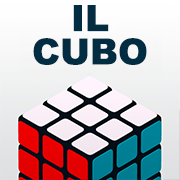

# 🧩 Il Cubo di Rubik — PWA


**© 2025 Alessandro Pezzali — Tutti i diritti riservati**  
**Licenza d’Uso — Il Cubo di Rubik PWA**

---

## 📖 Panoramica

Questa Progressive Web App (PWA) dedicata al **Cubo di Rubik** è il risultato di un percorso personale e professionale iniziato nel **2017** e portato avanti nel tempo con numerose iterazioni tecniche e grafiche.  
Il progetto nasce dopo un “inciampo” di **salute del 03 novembre 2016**: in quel momento un collega mi regalò un **Cubo di Rubik** come stimolo per reagire, mantenere la **dopamina** attiva e rimettere in moto la mente. Da lì è iniziato un viaggio durato quasi **10 anni**, fatto di prove, errori, studio e crescita nel coding.

> **Nota**: in rete possono esistere grafiche *simili* perché ispirate o rese possibili da **librerie pubbliche** e da materiali condivisi dalla community. **Il codice applicativo di questa PWA resta proprietario**: non è open source e non è liberamente riutilizzabile.

---

## 🎯 Obiettivi

- Offrire un **gioco 3D** del Cubo, fruibile da browser desktop e mobile.  
- Garantire **installazione e utilizzo offline** tramite meccanismi PWA.  
- Curare **usabilità** e **grafica** con attenzione alle performance.  
- Documentare il percorso tecnico come strumento di crescita personale.

---

## 🗂️ Struttura del progetto

/KubeApp
│── index.html
│── styles.css
│── cube.js
│── three.js
│── upup.min.js               (se usato per il caching offline)
│── service-worker.js         (alternativa standard per SW, se attivato)
│── manifest.webmanifest
│── /icons
│    ├── favicon.ico
│    ├── favicon-16x16.png
│    ├── favicon-32x32.png
│    ├── apple-touch-icon.png
│    └── meta-image.png
│── /plugins                  (se presenti)
│    ├── RoundedBoxGeometry.js
│    └── RoundedPlaneGeometry.js
│── README.md
│── readme.html

---

## 🧱 Tecnologie principali

- **three.js** — Rendering 3D del cubo e animazioni.  
- **PWA** — Manifest, icone, supporto installazione, caching offline.  
- **JavaScript + CSS** — UI minimale, controlli, timer e statistiche.  
- **(Storico)** Algoritmo di risoluzione inizialmente sviluppato in **Python** (fondamento concettuale; poi semplificato/“addomesticato” per il gioco).

---

## 🕹️ Funzionalità

- **Cubo 3D** interattivo (doppio click per partire).  
- **Preferenze**:
  - Dimensioni: 2×2, 3×3, 4×4, 5×5
  - Tipo di rotazione: Rapido, Morbido, Rimbalzo
  - Lunghezza mischia: 20, 25, 30
  - Angolo camera: Ortografica / Prospettica
  - Temi colore: Classico, Erno, Polvere, Camo, Pioggia (più regolazioni fine HSL)
- **Statistiche**: Miglior/Peggior tempo, medie (5/12/25).  
- **Timer** e segnalazioni (completato, miglior tempo).  
- **Modalità offline** (via UpUp *oppure* `service-worker.js`).  
- **UI** responsiva e ottimizzata per dispositivi mobili.

---

## 🧪 Storia & Fasi di sviluppo

- **2017 — Origini**  
  Prime scene 3D, studio delle notazioni (R, U, L, D, F, B), mockup UI.

- **2018–2019 — Algoritmo**  
  Prototipo in **Python** per la risoluzione. Base logica per successivi adattamenti “giocosi”.

- **2020–2021 — Grafica**  
  Ricerca di **soluzioni grafiche open** (geometrie arrotondate, materiali), blend fra estetica e prestazioni.

- **2022–2023 — PWA**  
  Manifest, icone, caching offline. UI per timer, statistiche, preferenze.

- **2024 — Ottimizzazioni**  
  Performance su mobile, rifiniture animazioni, pulizia del codice.

- **2025 — Consolidamento**  
  Revisione interfaccia, testo guida per principianti, pulizia asset, miglioramenti accessibilità.

> **Nota personale**: *“Io il Cubo non lo so risolvere.*  
> *Per questo ho sviluppato prima un algoritmo in Python e poi l’ho trasformato in gioco, anche grazie ai suggerimenti di appassionati online su colori, dimensioni e piccoli dettagli.”*

---

## ⚙️ Installazione & Avvio (dev)

- **Prerequisiti**: un server statico (anche `npx serve`, `python -m http.server`, estensioni tipo “Live Server”).  
- **Avvio locale**:
  1. Clona/copialo in una directory servita da HTTP/HTTPS.
  2. Apri `https://localhost:…/KubeApp/` (o il tuo host).
  3. Per funzioni PWA e caching è **consigliato HTTPS**.
- **Cache busting**: aggiorna `window.gameVersion` in `index.html` quando cambi asset.

---

## 📦 PWA & Offline

Sono supportati **due approcci** (scegline **uno**):

1. **UpUp** (`upup.min.js` + `UpUp.start(...)`)  
   - Semplice da integrare, già cablato in `index.html`.  
   - Richiede **HTTPS**.

2. **Service Worker standard** (`service-worker.js`)  
   - Registralo da `index.html` (se non lo fai già) ad es.:
     ```html
     <script>
       if ('serviceWorker' in navigator) {
         window.addEventListener('load', () => {
           navigator.serviceWorker.register('./service-worker.js');
         });
       }
     </script>
     ```
   - Personalizza liste di asset, strategie di cache e politiche di aggiornamento.

> Usa **solo uno** dei due metodi per evitare conflitti di caching.

---

## 🧭 Accessibilità & UX

- Testato su viewport piccoli e grandi.  
- Contrasti e dimensioni carattere pensati per leggibilità.  
- Guida in-app per principianti, apribile con il pulsante “?”.

---

## 🧩 Icone incluse

- `icons/apple-touch-icon.png`  
- `icons/favicon-16x16.png`  
- `icons/favicon-32x32.png`  
- `icons/favicon.ico`  
- `icons/meta-image.png` (per Open Graph / social)

---

## 🗺️ Roadmap (idee future)

- Modalità **allenamento** con step-by-step e suggerimenti.  
- Esportazione risultati e cronologia.  
- Miglior compatibilità iOS/Safari e miglioramento gesture.  
- Aggiornamento librerie 3D e rifiniture UI.

---

## 📝 Changelog (estratto)

- **0.0.2**  
  - Testi guida integrati; ritocchi UI; footer informativo.  
  - Migliorie accessibilità e minori fix.

- **0.0.1**  
  - Prima build pubblica di test (Windows/macOS).  
  - PWA base + caching (UpUp) + set icone.

---

## 🙌 Riconoscimenti

- **three.js** e community 3D per spunti e tecniche.  
- Geometrie e idee UI ispirate anche a componenti e snippet **pubblici** diffusi nella community (da cui la somiglianza di alcune soluzioni grafiche).  
- Appassionati del web per feedback su colori, dimensioni e interazioni.

---

## ⚖️ Licenza d’Uso (Tutti i diritti riservati)

**© 2025 Alessandro Pezzali. Tutti i diritti riservati.**  
Il software, i contenuti e gli asset grafici sono concessi in **uso** agli utenti finali **senza** trasferimento di diritti.

**Non è consentito**, senza **autorizzazione scritta** dell’autore:  
- Copiare, modificare, distribuire, pubblicare o **redistribuire** il codice o parti di esso.  
- Utilizzare il progetto (o derivati) a scopo **commerciale**.  
- Eseguire **reverse engineering** o rimuovere/alterare note di copyright.  

È consentito l’uso **personale** per giocare e testare l’app.  
Per richieste specifiche: contatti di seguito.

---

## 📫 Contatti

- Sito: **pezzalAPP.com**  
- Autore: **Alessandro Pezzali**  
- Progetto: **Il Cubo di Rubik PWA**
